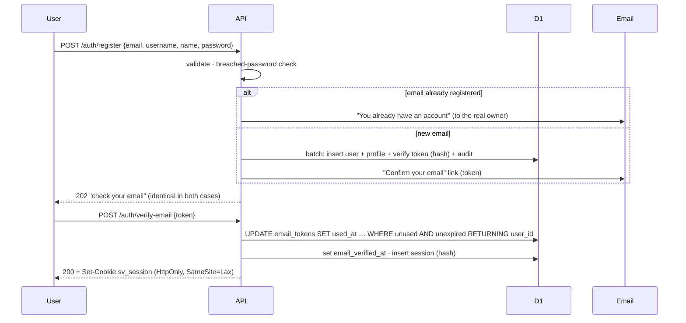
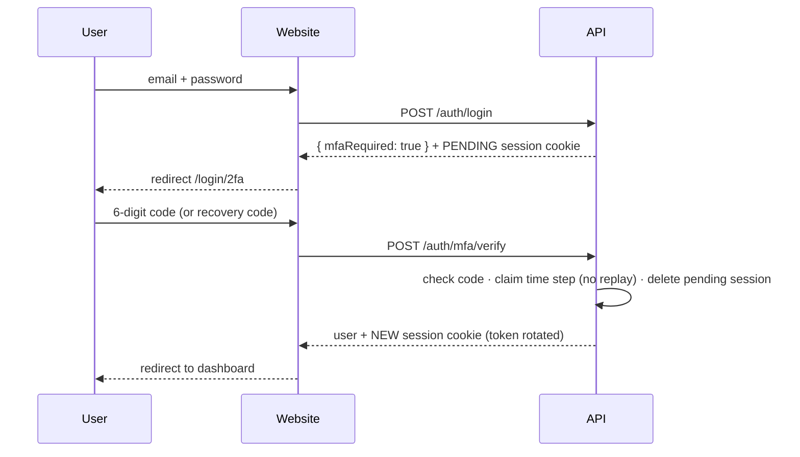

# Authentication

How accounts, sign-in and sessions work, and why each step is designed the way it is. Code lives in `apps/api/src/services/auth.service.ts`, `session.service.ts`, `account.service.ts` and `middleware/auth.ts`. Tests are in `apps/api/test/auth.test.ts`, `account.test.ts` and `access-control.test.ts`.

## Endpoints

| Method and path                          | Auth    | What it does                                                           |
| ---------------------------------------- | ------- | ---------------------------------------------------------------------- |
| `POST /api/v1/auth/register`             | public  | Create account and email a verification link (does not sign in)        |
| `POST /api/v1/auth/verify-email`         | public  | Redeem the link token, mark the email verified, **sign in**            |
| `POST /api/v1/auth/resend-verification`  | public  | Email a fresh verification link                                        |
| `POST /api/v1/auth/login`                | public  | Email + password → session cookie                                      |
| `POST /api/v1/auth/logout`               | public  | Delete the current session and clear the cookie                        |
| `POST /api/v1/auth/forgot-password`      | public  | Email a reset link (30 min)                                            |
| `POST /api/v1/auth/reset-password`       | public  | Redeem the reset token, set the password, sign out everywhere, sign in |
| `GET /api/v1/me`                         | session | The signed-in user and profile                                         |
| `PATCH /api/v1/me/profile`               | session | Edit profile / finish onboarding                                       |
| `GET /api/v1/me/sessions`                | session | List signed-in devices                                                 |
| `DELETE /api/v1/me/sessions/{handle}`    | session | Sign out one device                                                    |
| `POST /api/v1/me/sessions/revoke-others` | session | Sign out all other devices                                             |
| `POST /api/v1/me/password`               | session | Change password (needs the current one; signs out other devices)       |
| `POST /api/v1/auth/mfa/verify`           | pending | Second sign-in step: 2FA code or recovery code → full session          |
| `GET /api/v1/auth/google/start`          | public  | Begin Google sign-in (redirects to Google)                             |
| `GET /api/v1/auth/google/callback`       | public  | Google returns here (state + signed cookie checked)                    |
| `GET /api/v1/me/mfa`                     | session | 2FA on/off and recovery codes left                                     |
| `POST /api/v1/me/mfa/totp/setup`         | session | Start authenticator setup (secret + otpauth:// URI)                    |
| `POST /api/v1/me/mfa/totp/enable`        | session | Confirm with a code → 2FA on, 10 recovery codes (shown once)           |
| `POST /api/v1/me/mfa/recovery-codes`     | session | Replace recovery codes (needs a current code)                          |
| `POST /api/v1/me/mfa/disable`            | session | Turn off (needs password and a code)                                   |

All `/auth/*` endpoints share a strict per-IP limit (10/min), and `/me/password` has its own. Register, login, forgot-password and resend-verification also require a Cloudflare Turnstile token when Turnstile is configured ([bot-protection.md](../guides/bot-protection.md)).

## Sign-up and verification

**Why sign in only after verification?** The response to "register" must look identical whether or not the email exists (otherwise anyone could test which emails have accounts). If new accounts were signed in immediately, the presence of a cookie would give the answer away.

**Why a button on the verify page instead of verifying on page load?** Corporate email scanners open every link. A link that verified on `GET` would be "used" by the scanner, and could verify an address the owner never looked at.

## Sign-in

1. Look up the user by email. If there's none, still run a password hash against a dummy value, so the response time doesn't reveal that the account is missing. Return the generic "Incorrect email or password."
2. If the account is locked (10 failures → 15 minutes), return 429.
3. Verify the password (PBKDF2, constant-time compare). On failure, count it and write an audit entry.
4. Only after a correct password, reveal account problems ("suspended").
5. Reset the failure counter, upgrade the hash if it uses old settings, create the session, and write an audit entry.

## Sessions

See [ADR 0005](adr/0005-server-sessions.md). In short: a 256-bit random token in an HttpOnly cookie; the database stores only its SHA-256; there's a 7-day sliding idle expiry and a 30-day absolute expiry.

| Environment  | Cookie name         | Flags                                                 |
| ------------ | ------------------- | ----------------------------------------------------- |
| development  | `sv_session`        | HttpOnly, SameSite=Lax, Path=/                        |
| staging/prod | `__Host-sv_session` | HttpOnly, **Secure**, SameSite=Lax, Path=/, no Domain |

Every `/api/v1/*` request runs `loadSession`. It reads the cookie, loads the session, user and roles in one D1 batch, and rejects expired sessions or inactive accounts. It sets `c.var.auth` to the result or `null`, and deletes stale cookies. Routers then use `requireAuth`, `requireVerified` or `requireRole(...)`.

**Deny by default:** `test/access-control.test.ts` reads the OpenAPI document and calls every endpoint anonymously. Anything not on its short `PUBLIC` list must answer 401.

## Two-factor authentication (TOTP)

- **Pending session:** after the first factor (password, email link, password reset or Google), an account with 2FA gets a session with `mfa_verified = 0` and a 10-minute idle expiry. `loadSession` exposes it only as `c.var.pendingMfa`, never as a signed-in user, so every other endpoint answers 401. After 5 wrong codes the pending session is deleted.
- **Codes:** RFC 6238 TOTP (SHA-1, 6 digits, 30 s), accepting ±1 step for clock drift. The last accepted step is stored and claimed atomically, so a code can never be used twice (replay protection).
- **Secret storage:** encrypted with AES-256-GCM (`MFA_ENCRYPTION_KEY`), with a fresh IV per encryption. The QR code is rendered on our server as SVG, so no third-party QR service ever sees the secret.
- **Recovery codes:** 10 single-use codes (`ABCDE-FGHJK`, no look-alike characters), stored as SHA-256 hashes and shown once. Regenerating invalidates the old set.
- **Session rotation:** passing the 2FA step deletes the pending session and issues a brand-new token (session-fixation defence).
- **Mandatory 2FA:** the `requireMfa` middleware (403 `MFA_SETUP_REQUIRED`) will guard admin routes and payout settings.
- **No bypass:** password reset and email verification also end in the 2FA step for 2FA accounts.

## Google sign-in

OpenID Connect authorization code flow with **PKCE**, `state` and `nonce`. Setup: [google-sign-in.md](../guides/google-sign-in.md).

| Step                               | What happens                                                                                                                                                                                                                      |
| ---------------------------------- | --------------------------------------------------------------------------------------------------------------------------------------------------------------------------------------------------------------------------------- |
| `GET /api/v1/auth/google/start`    | Random `state`, PKCE verifier and `nonce` go into a short-lived (10 min) **HMAC-signed**, HttpOnly cookie `sv_oauth` (Path `/api/v1/auth/google`), then a redirect to Google with the S256 code challenge.                        |
| `GET /api/v1/auth/google/callback` | Verify the cookie signature and expiry, compare `state` in constant time (CSRF defence), exchange the code **server-to-server** with the verifier, then validate the ID token: issuer, audience, expiry, nonce, `email_verified`. |
| Account                            | Match by Google's stable `sub` (`oauth_accounts`), else by email, else create a verified, password-less account with a generated username.                                                                                        |
| Session                            | Normal session, or a **pending** one if the account has 2FA (continues at `/login/2fa`).                                                                                                                                          |

- **ID token signature** isn't checked because the token comes straight from Google's token endpoint over TLS, which OpenID Connect Core §3.1.3.7 permits. All claims are still validated.
- **Pre-hijacking defence:** if the matching local account was never verified, its password is cleared and all its sessions are signed out before linking. Someone who registered the victim's email in advance loses access.
- Every failure redirects to `/login?error=google_failed|google_cancelled|google_unavailable|account_suspended`. The reason is logged (`oauth.google_failed`), never put in the URL.
- Availability: `GOOGLE_CLIENT_ID` + `GOOGLE_CLIENT_SECRET` + the `auth.google` flag. `GET /api/v1/meta` reports it as `authProviders.google`.

## Passwords

- Policy: 10–128 characters with no composition rules, plus a **breached-password check** ([Have I Been Pwned](https://haveibeenpwned.com/Passwords), k-anonymity: only 5 characters of the SHA-1 prefix leave the server). It's on in staging and production and off locally.
- Hash: PBKDF2-HMAC-SHA256 with 100,000 iterations (the Workers maximum) and a 16-byte random salt. Input is normalised to NFKC so Unicode look-alikes behave consistently. The stored format is versioned: `pbkdf2$100000$salt$hash`.
- Reset or change signs out other devices and sends a "your password was changed" email.

> **CPU note:** PBKDF2 is native code in Workers, but 100k iterations is the most CPU-intensive thing we do. Measure it on staging (Workers dashboard → CPU time). If sign-in exceeds the free plan's 10 ms, that's the signal for Workers Paid (see [free-tier-limits.md](../operations/free-tier-limits.md)).

## Email

`services/email.service.ts` sends through Resend when `RESEND_API_KEY` is set. Otherwise it uses the **dev mailbox**: emails are printed in the terminal and listed at `/dev/mailbox`. Templates (`lib/email-templates.ts`) escape every inserted value.

## Known limitations (tracked)

- **Account pre-hijacking:** someone could register a victim's email with their own password. The account stays unverified; if the victim signs up they're told "you already have an account" (with a reset link), and a password reset or Google sign-in by the real owner removes the attacker's password and sessions.
