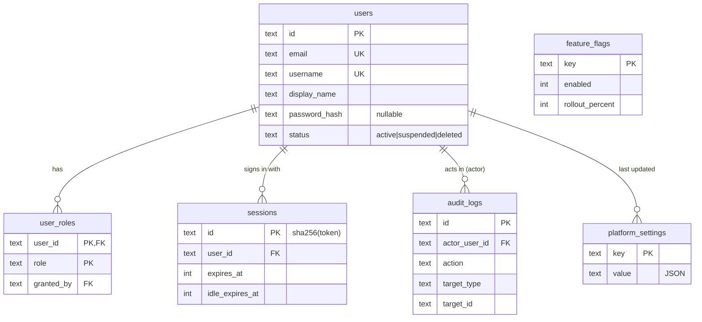

# Database schema

The authoritative definition is the code in [`packages/db/src/schema/`](../../packages/db/src/schema/), where every column has a comment. This page explains **what each table is for** and how the tables relate. Update it in the same commit as any migration (`npm run docs:check` enforces this).

**Conventions:** ids are `TEXT` UUIDv7, timestamps are `INTEGER` epoch milliseconds (UTC), money is `INTEGER` paise, booleans are `INTEGER` 0/1.

## Relationships

## Identity (`schema/identity.ts`)

### `users`

One row per account. Holds only identity and login data. Profile details (bio, links, interests) get their own table in Phase 1 so that this hot table stays small.

- `email` and `username` are unique and stored lower-case.
- `password_hash` is `NULL` for accounts that only use Google or email-link sign-in. The format is versioned (`pbkdf2$<iterations>$<salt>$<hash>`), so the algorithm can be upgraded without forcing password resets.
- `status = 'deleted'` plus `deleted_at` marks an account awaiting permanent deletion 30 days later (DPDP/GDPR right to erasure).

### `user_roles`

Extra roles on top of the implicit `learner`: `instructor`, `mentor`, `moderator`, `org_admin`, `admin`, `super_admin`. One row per (user, role). `granted_by` records which admin granted it (`NULL` = granted automatically). Deleting a user removes their roles.

### `sessions`

Server-side login sessions ([ADR 0005](adr/0005-server-sessions.md)). The browser keeps a random token in an HttpOnly cookie, and this table stores only **its SHA-256 hash**, so a database leak can't be used to log in. Two expiries: `idle_expires_at` (sliding, 7 days) and `expires_at` (absolute, 30 days). `mfa_verified` records whether 2FA was completed in this session. `ip_hash` is a salted hash, never the raw IP.

## Platform (`schema/platform.ts`)

### `platform_settings`

Admin-editable configuration as key → JSON value, e.g. `commerce.platform_fee_bps = 3000` (30%). Business numbers live here instead of in code, so they can change without a deploy. The defaults are loaded by `packages/db/seed/seed.sql`.

### `feature_flags`

On/off switches with a percentage rollout. Unfinished features ship disabled and are enabled gradually. Public flags are exposed through `GET /api/v1/meta` (cached for 60 s per Worker instance).

### `audit_logs`

**Append-only** record of security- and money-relevant actions: logins, role changes, refunds, payouts, admin edits. Application code only ever inserts into it. `metadata` is JSON and must never contain secrets or full payment details. `request_id` links to the API log line.

## Planned tables (by phase)

Documented here when their migration is written:

| Phase | Tables                                                                                                                                                                                    |
| ----- | ----------------------------------------------------------------------------------------------------------------------------------------------------------------------------------------- |
| 1     | user profiles, OAuth accounts, email tokens, password resets, MFA, categories, tags, courses, sections, lessons, enrollments, progress, reviews, discussions, notifications, certificates |
| 2     | products, prices, carts, orders, payments, refunds, coupons, invoices, ledger entries, payout accounts, payouts, referrals, webhook inbox                                                 |
| 3     | XP events, achievements, streaks, challenges, problems, submissions, contests, learning paths, study pods                                                                                 |
| 4     | exams, question banks, attempts, credentials, capstone projects, peer reviews                                                                                                             |
| 5     | mentor profiles, availability, bookings, skill-swap offers and matches, time-credit ledger, conversations, messages, bounties                                                             |
| 6     | plans, subscriptions, revenue pool periods, sponsored campaigns, flashcards, pledges, scholarships                                                                                        |
| 7     | organizations, members, seat assignments, job posts                                                                                                                                       |
