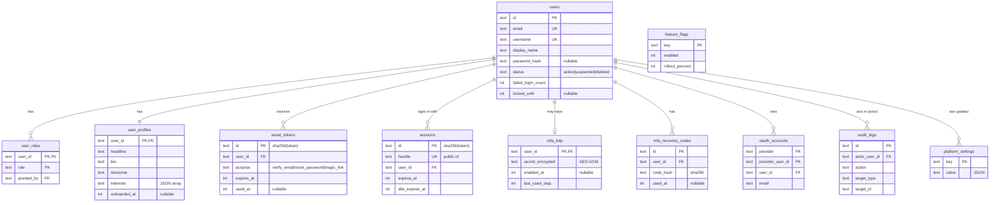
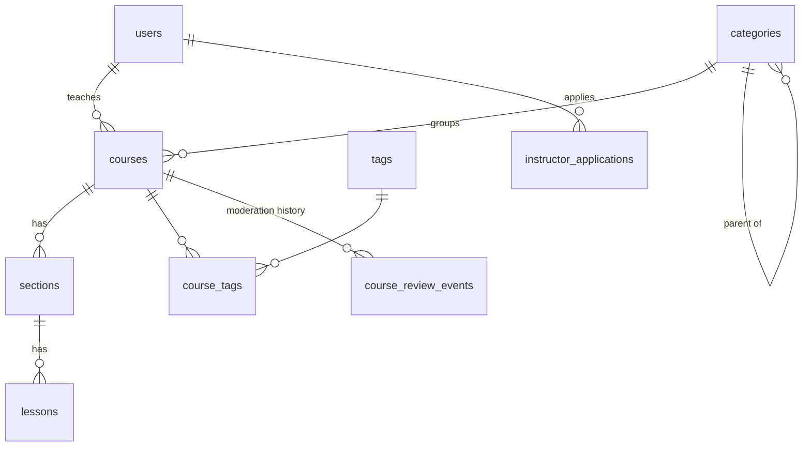

# Database schema

The authoritative definition is the code in [`packages/db/src/schema/`](../../packages/db/src/schema/), where every column has a comment. This page explains **what each table is for** and how the tables relate. Update it in the same commit as any migration (`npm run docs:check` enforces this).

**Conventions:** ids are `TEXT` UUIDv7, timestamps are `INTEGER` epoch milliseconds (UTC), money is `INTEGER` paise, booleans are `INTEGER` 0/1.

## Relationships

## Identity (`schema/identity.ts`)

### `users`

One row per account. Holds only identity and login data. Profile details live in `user_profiles`, so this table (read on every signed-in request) stays small.

- `email` and `username` are unique and stored lower-case.
- `email_verified_at` is `NULL` until the user clicks the verification link. Unverified users can sign in but can't buy, teach or post.
- `password_hash` is `NULL` for accounts that only use Google or email-link sign-in. The format is versioned (`pbkdf2$<iterations>$<salt>$<hash>`), so the algorithm can be upgraded without forcing password resets. It is selected only by the sign-in query.
- `failed_login_count` / `locked_until`: after 10 wrong passwords in a row, password sign-in is refused for 15 minutes. A successful sign-in or a password reset clears them.
- `status = 'deleted'` plus `deleted_at` marks an account awaiting permanent deletion 30 days later (DPDP/GDPR right to erasure).

### `user_profiles`

One row per user, created together with the account. Public profile (headline, Markdown bio, https website, location) plus preferences: `timezone` (streaks, reminders, bookings), `interests` (JSON array of category slugs, used for recommendations) and `goal`. `onboarded_at` is `NULL` until the onboarding questions are answered, and the website shows onboarding until then.

### `email_tokens`

Single-use tokens sent in emails: `verify_email` (24 h), `reset_password` (30 min) and `magic_link` (30 min, used later in Phase 1). Only the SHA-256 of the token is stored. A token is redeemed by one atomic `UPDATE … WHERE used_at IS NULL AND expires_at > now RETURNING user_id`, so two clicks can't both succeed. Requesting a new link deletes the user's older unused links of the same purpose.

### `user_roles`

Extra roles on top of the implicit `learner`: `instructor`, `mentor`, `moderator`, `org_admin`, `admin`, `super_admin`. One row per (user, role). `granted_by` records which admin granted it (`NULL` = granted automatically). Deleting a user removes their roles.

### `sessions`

Server-side login sessions ([ADR 0005](adr/0005-server-sessions.md)). The browser keeps a random token in an HttpOnly cookie, and this table stores only **its SHA-256 hash**, so a database leak can't be used to log in. Two expiries: `idle_expires_at` (sliding, 7 days) and `expires_at` (absolute, 30 days). `mfa_verified` records whether 2FA was completed in this session. `ip_hash` is a salted hash, never the raw IP. `handle` is a separate public UUID used by the "your devices" screen and the revoke endpoint, so the token hash never leaves the server. `last_seen_at` and the idle expiry are refreshed at most once an hour, which keeps writes low.

### `mfa_totp`

The authenticator-app second factor, at most one per user. `secret_encrypted` is the shared TOTP secret encrypted with AES-256-GCM using the `MFA_ENCRYPTION_KEY` secret, so a database leak alone can't generate codes. `enabled_at` is `NULL` while setup is unconfirmed; 2FA is only enforced once it is set. `last_used_step` is the 30-second time step of the last accepted code; codes for that step or earlier are rejected (no replay). It is updated atomically.

While 2FA is on, signing in with a password (or an email link, or Google) creates a _pending_ session (`sessions.mfa_verified = 0`, 10-minute idle expiry) that can only submit a code. `sessions.mfa_attempts` counts wrong codes, and the pending session is deleted after 5.

### `mfa_recovery_codes`

Ten single-use backup codes per user, issued when 2FA is turned on or regenerated. Only the SHA-256 of each normalised code (upper-case, no dash) is stored. `used_at` marks a code as spent, and regenerating deletes all previous codes.

### `oauth_accounts`

External sign-in identities (Google) linked to a user, keyed by (`provider`, `provider_user_id`). The provider's stable user id (Google's `sub`) is used, never the email, which can change. A user can have a password, a Google identity, or both.

## Catalog (`schema/catalog.ts`)

### `categories`

Top-level subjects (and optional sub-categories via `parent_id`). The 12 top-level categories are created by the **data migration** `0004_seed_categories.sql`, so they exist in every environment. Their slugs match the onboarding interests (`INTEREST_OPTIONS`), so a learner's interests map straight to categories. `icon` is a lucide icon name and `position` sets menu order.

### `tags` and `course_tags`

Free-form topic labels ("react", "excel", "guitar-chords") shared across courses, linked many-to-many. Tags are created when an instructor first uses them. Slugs are unique and normalised.

### `courses`

One row per course, owned by `instructor_id`. The owner can't be deleted while they own courses (`RESTRICT`): enrolled learners must keep access, so account deletion has to transfer or archive courses first.

- **Status lifecycle:** `draft` → (instructor submits) `in_review` → (reviewer) `published` or `rejected` (with `review_notes`). A rejected course goes back to editing and can be resubmitted. Published courses can be `archived`.
- **Price:** `price_in_paise` (0 = free), currency `INR`. Payments arrive in Phase 2.
- **Denormalised counters:** `lesson_count` and `duration_minutes` are recomputed whenever lessons change; `enrollment_count`, `rating_sum` and `rating_count` are updated as learners enrol and review. Average rating = `rating_sum / rating_count` (integers, so no rounding drift).
- `learning_outcomes` and `requirements` are JSON arrays of short strings. `description` is Markdown.
- Indexes serve the catalog (`status, published_at`), category pages (`category_id, status`) and the instructor's studio (`instructor_id, updated_at`).

### `sections` and `lessons`

A course is divided into ordered sections, and each section into ordered lessons (`position`).

- `lessons.course_id` is denormalised from the section, so course-wide queries (counts, the player's outline) need no join.
- `type` is one of `video`, `article`, `quiz` or `code` (quiz and code content arrive with their features).
- `is_preview`: visible on the course page without enrolling.
- **Video:** `video_provider` (`youtube`, `vimeo` or `r2`) plus `video_ref`, which holds the provider's video id or an R2 object key, **never a raw URL**. The page builds the embed URL itself, so no arbitrary URL can be injected into an iframe.
- `content_markdown` holds the article body or notes under a video, and is rendered sanitised.

### `instructor_applications`

Requests to teach. `topics` is a JSON array of category slugs, and `sample_url` is an https link to a teaching sample. A reviewer (admin or moderator) approves, which **grants the `instructor` role** in `user_roles`, or rejects with `review_notes`. At most one pending application per user (enforced by the service).

### `course_review_events`

Append-only moderation history per course: `submitted`, `approved`, `rejected` (with notes) and `archived`, with who did it and when. The course row shows only the latest state; this table shows how it got there.

## Platform (`schema/platform.ts`)

### `platform_settings`

Admin-editable configuration as key → JSON value, e.g. `commerce.platform_fee_bps = 3000` (30%). Business numbers live here instead of in code, so they can change without a deploy. The defaults are loaded by `packages/db/seed/seed.sql`.

### `feature_flags`

On/off switches with a percentage rollout. Unfinished features ship disabled and are enabled gradually. Public flags are exposed through `GET /api/v1/meta` (cached for 60 s per Worker instance).

### `audit_logs`

**Append-only** record of security- and money-relevant actions: logins, role changes, refunds, payouts, admin edits. Application code only ever inserts into it. `metadata` is JSON and must never contain secrets or full payment details. `request_id` links to the API log line.

## Planned tables (by phase)

Documented here when their migration is written:

| Phase | Tables                                                                                                                                    |
| ----- | ----------------------------------------------------------------------------------------------------------------------------------------- |
| 1     | enrollments, progress, notes, reviews, discussions, notifications, certificates                                                           |
| 2     | products, prices, carts, orders, payments, refunds, coupons, invoices, ledger entries, payout accounts, payouts, referrals, webhook inbox |
| 3     | XP events, achievements, streaks, challenges, problems, submissions, contests, learning paths, study pods                                 |
| 4     | exams, question banks, attempts, credentials, capstone projects, peer reviews                                                             |
| 5     | mentor profiles, availability, bookings, skill-swap offers and matches, time-credit ledger, conversations, messages, bounties             |
| 6     | plans, subscriptions, revenue pool periods, sponsored campaigns, flashcards, pledges, scholarships                                        |
| 7     | organizations, members, seat assignments, job posts                                                                                       |
