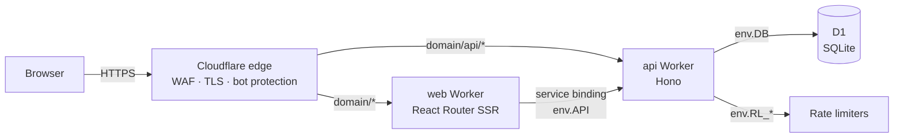
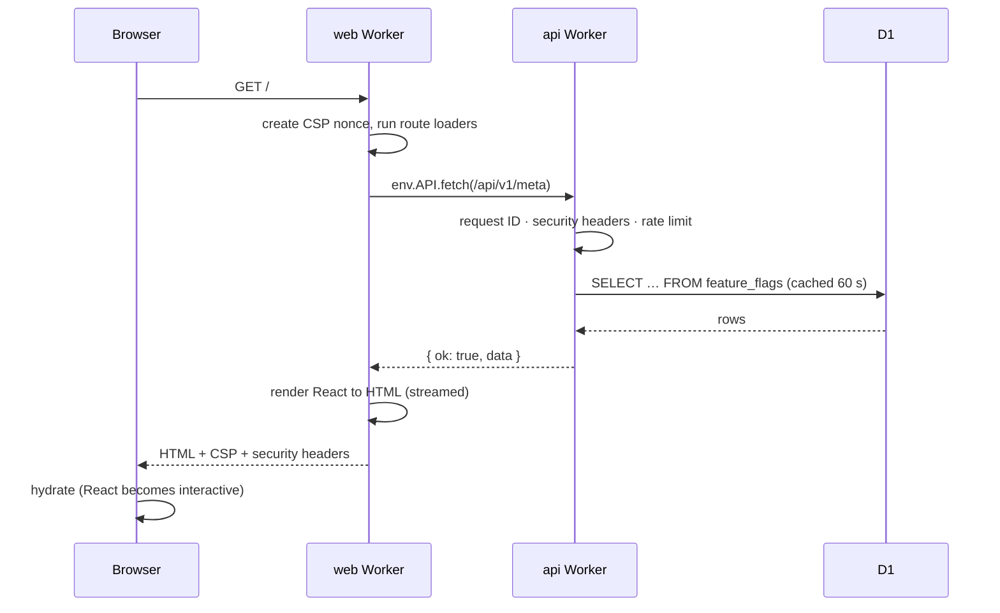

# Architecture overview

## The big picture



Later phases add R2 (files and video), Durable Objects (notifications, chat, live leaderboards), Queues (email, webhooks) and Cron Triggers (scheduled jobs) as further bindings of the API Worker. External services (Razorpay, Resend email, Judge0, Google OAuth, AdSense) are called from the API over HTTPS.

## One origin

In production the browser only ever talks to **one origin**, `https://<domain>`. Cloudflare routes `/api/*` to the API Worker and everything else to the web Worker. This means:

- no CORS configuration (a whole class of misconfiguration bugs is gone);
- cookies can use the strict `__Host-` prefix;
- CSRF protection is simpler (see [ADR 0006](adr/0006-ssr-same-origin.md)).

In local development and on `*.workers.dev` staging there are no custom routes, so the web Worker forwards `/api/*` to the API itself (`apps/web/workers/app.ts`). The browser sees the same single origin either way.

## A page request, step by step



## Inside the API

```
middleware (every request)            route groups
┌──────────────────────────────┐      ┌──────────────────────────────────────────┐
│ requestContext  (id, log, db)│      │ routes/*.routes.ts   HTTP + Zod + OpenAPI │
│ securityHeaders              │  →   │   ↓                                       │
│ rateLimit (/api/v1/*)        │      │ services/*.service.ts   business rules    │
│ csrfProtection (non-GET)     │      │   ↓                                       │
│ bodyLimit (64 KB)            │      │ repositories/*.ts   Drizzle queries → D1  │
└──────────────────────────────┘      └──────────────────────────────────────────┘
errors anywhere → errorHandler → { ok:false, error:{ code, message, fields?, requestId } }
```

- **Routes** know HTTP. **Services** know the rules. **Repositories** know SQL. Each layer only calls the next one down, which keeps the logic testable and the security checks in one place.
- All responses use the envelope `{ ok: true, data }` or `{ ok: false, error }` defined in `packages/shared/src/errors.ts`.

## Inside the website

- `workers/app.ts`: Worker entry. Forwards `/api`, creates the per-request context (CSP nonce) and hands off to React Router.
- `app/root.tsx`: HTML shell, root loader (theme, nonce, public config) and error page.
- `app/routes/*`: one module per page (`loader` for data, `meta` for SEO, component for UI).
- `app/entry.server.tsx`: streams the HTML and sets the security headers.

## Shared code

`packages/shared` holds what both sides must agree on: validation schemas, the error contract, money helpers, ID format and constants. `packages/db` holds the schema and migrations, used by the API and by tooling.

## Key decisions

Each is recorded as an ADR in [adr/](adr/):

| #    | Decision                                                               |
| ---- | ---------------------------------------------------------------------- |
| 0001 | [Run everything on Cloudflare Workers](adr/0001-cloudflare-workers.md) |
| 0002 | [D1 + Drizzle as the database](adr/0002-d1-drizzle.md)                 |
| 0003 | [npm-workspaces monorepo](adr/0003-monorepo.md)                        |
| 0004 | [Atomic writes with D1 `batch()`](adr/0004-d1-atomicity.md)            |
| 0005 | [Server-side sessions instead of JWTs](adr/0005-server-sessions.md)    |
| 0006 | [SSR on one origin with a CSP nonce](adr/0006-ssr-same-origin.md)      |
