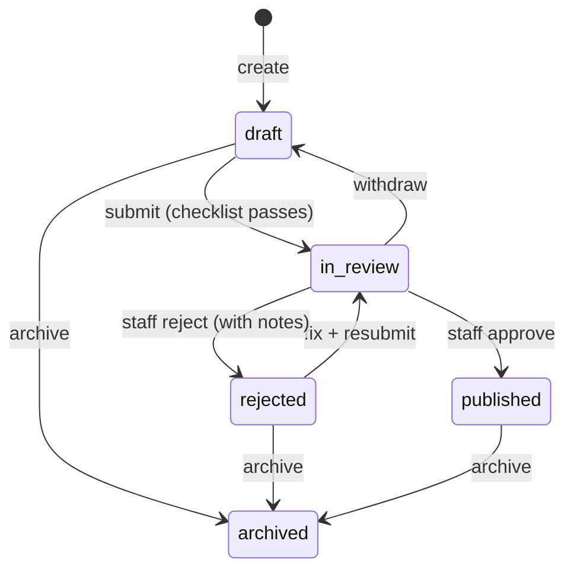

# Teaching: instructors, the course builder and course review

How someone becomes an instructor, builds a course and gets it published. The code lives in:

| Layer        | Files                                                                                                                                     |
| ------------ | ----------------------------------------------------------------------------------------------------------------------------------------- |
| Validation   | `packages/shared/src/schemas/catalog.ts`, `video.ts`, `course-checklist.ts`                                                               |
| Routes       | `apps/api/src/routes/teach.routes.ts` (learner + Studio), `admin.routes.ts` (staff)                                                       |
| Services     | `instructor.service.ts`, `course-builder.service.ts`, `course-review.service.ts`                                                          |
| Policies     | `apps/api/src/policies/index.ts` (ownership and status rules)                                                                             |
| Repositories | `courses.repository.ts`, `instructor-applications.repository.ts`                                                                          |
| Tables       | `courses`, `sections`, `lessons`, `tags`, `course_tags`, `instructor_applications`, `course_review_events` ([schema](database-schema.md)) |
| Tests        | `apps/api/test/teaching.test.ts`                                                                                                          |

## 1. Becoming an instructor

```mermaid
sequenceDiagram
  actor L as Learner
  participant API
  actor A as Staff (admin / moderator)
  L->>API: POST /me/instructor-application (headline, topics, experience, sample link)
  API-->>L: 201 pending
  A->>API: GET /admin/instructor-applications?status=pending
  alt approve
    A->>API: POST /admin/instructor-applications/{id}/approve
    API->>API: grant role "instructor" + audit log (one batch)
    API-->>L: email "You can now teach"
  else reject (feedback required, 10+ chars)
    A->>API: POST /admin/instructor-applications/{id}/reject
    API-->>L: email with feedback; they may apply again
  end
```

Rules:

- A verified email is required to apply. One **pending** application at a time; existing instructors can't apply.
- A decision only applies to a `pending` application (conditional update), so two reviewers clicking at once can't both win: the second gets `409`.
- **Separation of duties:** staff can't decide their own application.

## 2. The course lifecycle



| Status      | Instructor can edit?                    | Visible in the catalog?            |
| ----------- | --------------------------------------- | ---------------------------------- |
| `draft`     | yes                                     | no                                 |
| `in_review` | **no** (withdraw first)                 | no                                 |
| `rejected`  | yes, then resubmit                      | no                                 |
| `published` | yes (live edits; see limitations below) | yes                                |
| `archived`  | no                                      | no (enrolled learners keep access) |

Every transition is a **conditional update** (`UPDATE … WHERE status IN (…)`), so a stale browser tab can't move a course from a state it's no longer in. Submissions, decisions and archiving are written to `course_review_events` (the history reviewers see) and to `audit_logs`.

### The submission checklist

`submissionChecklist()` in `packages/shared/src/course-checklist.ts` runs on submit, is shown live in the Studio editor, and is shown to reviewers. A course needs:

- a subtitle (10+ characters), a description (200+ characters) and a category;
- at least 3 learning outcomes;
- at least 1 section and 3 lessons, and no empty sections;
- a video link on every video lesson, and 50+ characters in every article lesson.

A failed submit returns `400 VALIDATION_FAILED` with the problems in `error.fields.checklist`, ready to show as a to-do list.

## 3. Studio endpoints (`/api/v1/studio/*`)

Access: signed in + verified email + role `instructor`. Then each service loads the course and checks **ownership** through `policies/`.

| Method   | Path                                    | Does                                                     |
| -------- | --------------------------------------- | -------------------------------------------------------- |
| `GET`    | `/studio/courses`                       | My courses                                               |
| `POST`   | `/studio/courses`                       | Create a draft (title, optional category)                |
| `GET`    | `/studio/courses/{id}`                  | Course + full curriculum for the editor                  |
| `PATCH`  | `/studio/courses/{id}`                  | Details, price, outcomes, requirements, tags             |
| `POST`   | `/studio/courses/{id}/submit`           | Submit for review                                        |
| `POST`   | `/studio/courses/{id}/withdraw`         | Back out of the queue                                    |
| `POST`   | `/studio/courses/{id}/archive`          | Hide from the catalog                                    |
| `POST`   | `/studio/courses/{id}/sections`         | Add a section                                            |
| `POST`   | `/studio/courses/{id}/sections/reorder` | New order: `{ ids: [...] }` with **every** section once  |
| `PATCH`  | `/studio/sections/{id}`                 | Rename                                                   |
| `DELETE` | `/studio/sections/{id}`                 | Delete with its lessons                                  |
| `POST`   | `/studio/sections/{id}/lessons`         | Add a lesson (`video` or `article`)                      |
| `POST`   | `/studio/sections/{id}/lessons/reorder` | New lesson order within the section                      |
| `PATCH`  | `/studio/lessons/{id}`                  | Title, content, video link, preview flag, duration, move |
| `DELETE` | `/studio/lessons/{id}`                  | Delete                                                   |

Every write returns the whole updated course (the same shape as `GET`), so the editor simply re-renders what the server says instead of patching its own copy.

## 4. Review endpoints (`/api/v1/admin/*`)

Access: role `admin`, `super_admin` or `moderator` **and** 2FA turned on (`requireMfa`). Local development relaxes the 2FA part with `ENFORCE_ADMIN_MFA="off"` so the demo admin works; staging and production set `"on"`.

| Method | Path                                            | Does                                       |
| ------ | ----------------------------------------------- | ------------------------------------------ |
| `GET`  | `/admin/instructor-applications?status=pending` | Applications, oldest first                 |
| `POST` | `/admin/instructor-applications/{id}/approve`   | Grant the instructor role                  |
| `POST` | `/admin/instructor-applications/{id}/reject`    | Reject with `notes` (required)             |
| `GET`  | `/admin/course-reviews`                         | Courses waiting for review, oldest first   |
| `GET`  | `/admin/course-reviews/{id}`                    | Curriculum, checklist, instructor, history |
| `POST` | `/admin/course-reviews/{id}/approve`            | Publish                                    |
| `POST` | `/admin/course-reviews/{id}/reject`             | Send back with `notes` (required)          |

Staff can't review their own course.

## 5. Security notes

- **IDOR:** someone else's course, section or lesson answers `404`, never `403`, so ids can't be probed. Tested for every Studio endpoint.
- **Cross-course tampering:** reorder requests must list exactly the current rows (no missing, extra or foreign ids), and a lesson can only move to a section of the same course.
- **Video links** are parsed on the server into `{provider, ref}` (YouTube or Vimeo only) and only the id is stored. Players are built from the id with privacy-friendly embed hosts (`youtube-nocookie.com`, Vimeo `dnt=1`), so an instructor can't inject an arbitrary URL into learners' pages.
- **Slugs** are generated on the server from the title (accents stripped, plus a short random suffix so identical titles never collide); instructors don't choose URLs.
- **Money:** prices are integer paise, either free or whole rupees from ₹199 to ₹4,999 (validated in the shared schema).

## 6. Website pages

| URL                                           | Who                | File in `apps/web/app/routes/`                        |
| --------------------------------------------- | ------------------ | ----------------------------------------------------- |
| `/teach`                                      | everyone           | `teach.tsx`: pitch, apply, application status         |
| `/studio`                                     | instructors        | `studio/index.tsx`: my courses, new course            |
| `/studio/courses/:courseId`                   | the course's owner | `studio/course.tsx`: details, curriculum, submit      |
| `/studio/courses/:courseId/lessons/:lessonId` | the course's owner | `studio/lesson.tsx`: video link with preview, or text |
| `/admin`                                      | staff              | `admin/index.tsx`: what's waiting                     |
| `/admin/applications`                         | staff              | `admin/applications.tsx`                              |
| `/admin/courses`, `/admin/courses/:courseId`  | staff              | `admin/courses.tsx`, `admin/course.tsx`               |

How they're built:

- **No JavaScript required.** Every change is an ordinary form post with an `intent` (for example `move-section`), handled by the page's `action`. Up/down arrows reorder items; the new order is computed on the server from fresh data.
- **One checklist.** The editor shows `submissionChecklist()` from `@skillverse/shared` live, the same function the API runs on submit.
- **Hidden areas stay hidden.** Non-instructors visiting `/studio` are sent to `/teach`; non-staff visiting `/admin` get a 404. Links in the account menu follow the same roles (`app/lib/roles.ts`), but that is only presentation: the API checks every request.
- **2FA gate.** If the API answers `MFA_SETUP_REQUIRED`, the admin layout shows a "turn on two-factor authentication" screen linking to Settings → Security.
- **Untrusted text stays text.** Reviewers see lesson Markdown as plain text and open videos on YouTube/Vimeo. The Studio preview iframe only loads `youtube-nocookie.com` or `player.vimeo.com` URLs rebuilt from a validated id, and the CSP allows no other frames.

## 7. Known limitations (tracked)

- Edits to a **published** course go live immediately. A "draft changes, then re-review" flow is planned before paid courses launch (Phase 2).
- Only video and article lessons can be built today; quiz and code lessons come with the practice arena.
- Video hosting is by link (YouTube or Vimeo, unlisted is fine). Uploads to R2 come in a later phase.
- The "your course is live" email links to `/courses/<slug>`, which arrives with the catalog in the next chunk.
- Reordering uses up/down buttons; drag-and-drop can be layered on top later without changing the API.
